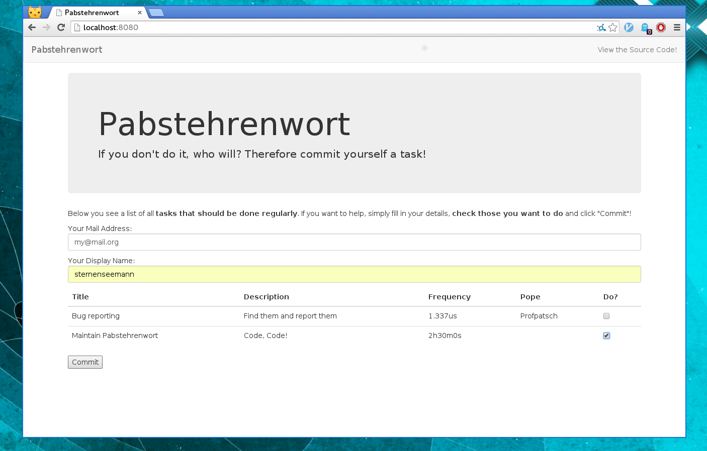

= Papstehrenwort: Commitment-System für das Openlab Augsburg

**Idee**: Mitglieder sollen sich für eine Aufgabe verpflichten können, daran
erinnert werden und bestätigen, ob sie der Aufgabe nachgegangen sind oder nicht.

== Einfachstmögliche Implementierung:

* Es gibt eine Liste von Aufgaben (die von Admins angelegt wird).
** Aufgabe: Titel, Beschreibung, nötige Häufigkeit
* Jeder User kann sich für 0..n Augaben verpflichten
* Wird die Aufgabe fällig, wird dem Nutzer eine Erinnerung zugeschickt
* Der Nutzer kann Bestätigen, sobald er die Aufgabe beendet hat.
* Wird innerhalb eines gewissen Zeitraums nicht bestätigt, wird eine weitere
  Erinnerung geschickt (repeat)

== Praktisch:

* Nutzer meldet sich mit seiner Mailadresse an (und Namen)
* HTTP-Interface
* Nutzer sieht Liste mit Aufgaben und können sich verpflichten
* Wenn Aufgabe fällig wird, wird eine Mail an die Mailadresse gesendet
* In der Mail ist ein Link, über den man die Erledigung bestätigen kann.
* Wird nach $Zeit noch nicht bestätigt, wird eine Erinnerung gesendet.
* Nach zwei Erinnerungen wird der User aus der Aufgabe gestrichen.

== Ideen für später

* GPG-Auth
* Mehrere Nutzer pro Task (können sich ihn aufteilen.)
* Public Shaming Funktion

== Rumbasteln

.Abhängigkeiten
    * npm (node.js)
    * gem (ruby)

make:: Abhängigkeiten installieren (lokal)
make clean:: Abhängigkeiten entfernen
make watch:: Coffescript -> JS & SCSS -> CSS